<!-- •••••••••••••••••••••••••••••••••••••••••••••••••••••••••••••••••••••••••••

	Angular Boot Camp

••••••••••••••••••••••••••••••••••••••••••••••••••••••••••••••••••••••••••• -->

<!-- _backgroundColor: #000 -->
<!-- _class: invert p_left h6_right -->

# Angular Boot Camp

&nbsp;
Presentan:
&nbsp;

- Edgardo Robledo
- Eli Jaimes
- Rogelio Perez
- Saul Dennis

&nbsp;

###### **Enero 2024**

---

<!-- •••••••••••••••••••••••••••••••••••••••••••••••••••••••••••••••••••••••••••

	1. ¿Qué es Angular?

••••••••••••••••••••••••••••••••••••••••••••••••••••••••••••••••••••••••••• -->

<!-- _class: invert title_with_image -->

## 1. ¿Qué es &nbsp;?

&nbsp;

- Es un web framework que permite simplificar y optimizar el desarrollo de aplicaciones rápidas y confiables.
- Proporciona un amplio conjunto de herramientas, API y bibliotecas.
- Mantiene el código organizado con un modelo de componente y un sistema de inyección de dependencias flexible.
- Aplicaciones confiables que escalan con el tamaño dee equipo y el tamaño del código fuente.

---

<!-- •••••••••••••••••••••••••••••••••••••••••••••••••••••••••••••••••••••••••••

	2. Angular CLI (Command-Line Interface)

••••••••••••••••••••••••••••••••••••••••••••••••••••••••••••••••••••••••••• -->

## 2. Angular CLI (Command-Line Interface)

- Se utiliza para _inicializar_, _desarrollar_ y _mantener_ aplicaciones Angular directamente desde un shell de comandos.
- Instale el CLI utilizando NPM (Node Package Manager)

`npm install -g @angular/cli`

- Invoca la herramienta en la línea de comando a través del ejecutable _ng_.

`ng --help`

- Crearemos la aplicación que utilizaremos a lo largo del curso

`ng new AngularBootCamp --standalone false --skip-git --dry-run`

`ng new AngularBootCamp --standalone -g -d`

- https://angular.io/cli

---

<!-- •••••••••••••••••••••••••••••••••••••••••••••••••••••••••••••••••••••••••••

	3. Ejecutar la aplicación Angular

••••••••••••••••••••••••••••••••••••••••••••••••••••••••••••••••••••••••••• -->

---

## 3. Ejecutar la aplicación Angular

- Para ejecutar la aplicación podemos hacer uso de los scripts en _package.json_

&nbsp;

| `npm start`                                | `ng serve`                                 |
| ------------------------------------------ | ------------------------------------------ |
|  |  |

---

<!-- •••••••••••••••••••••••••••••••••••••••••••••••••••••••••••••••••••••••••••

	4. Herramientas para el desarrollo en Angular

••••••••••••••••••••••••••••••••••••••••••••••••••••••••••••••••••••••••••• -->

---

## 4. Herramientas para el desarrollo en Angular

- Visual Studio Code, https://code.visualstudio.com/
- Angular Language Service, https://marketplace.visualstudio.com/items?itemName=Angular.ng-template
- angular2-inline, https://marketplace.visualstudio.com/items?itemName=natewallace.angular2-inline
- angular2-switcher, https://marketplace.visualstudio.com/items?itemName=infinity1207.angular2-switcher

<!-- •••••••••••••••••••••••••••••••••••••••••••••••••••••••••••••••••••••••••••

	5. Herramientas para desarrollo Web

••••••••••••••••••••••••••••••••••••••••••••••••••••••••••••••••••••••••••• -->

---

## 5. Herramientas para desarrollo Web

- Bookmarks, https://marketplace.visualstudio.com/items?itemName=alefragnani.Bookmarks
- Code Spell Checker, https://marketplace.visualstudio.com/items?itemName=streetsidesoftware.code-spell-checker
- Error Lens, https://marketplace.visualstudio.com/items?itemName=usernamehw.errorlens
- ESLint, https://marketplace.visualstudio.com/items?itemName=dbaeumer.vscode-eslint
- Prettier - Code formatter, https://marketplace.visualstudio.com/items?itemName=esbenp.prettier-vscode, `npm i -D prettier`
- Todo Tree, https://marketplace.visualstudio.com/items?itemName=Gruntfuggly.todo-tree

<!-- •••••••••••••••••••••••••••••••••••••••••••••••••••••••••••••••••••••••••••

	6. Bloques de Construcción en Angular

••••••••••••••••••••••••••••••••••••••••••••••••••••••••••••••••••••••••••• -->

---

## 6. Bloques de Construcción en Angular

- **Modules**, (módulos): declaran el _contexto de compilación_ para un conjunto de **componentes** relacionados y dedicados a alguna característica. _Agrupación de **componentes**, **tuberías** y **directivas** relacionadas_. Ayudan al compilador de Angular a resolver correctamente los componentes y unirlos a los elementos DOM apropiados en sus plantillas.

---

<!-- _class: invert p_left -->

### 6.1 Módulos

`ng generate module MyFirstModule --module app --routing --dry-run`

`ng g m MyFirstModule -m app --routing -d`

https://angular.io/cli/generate#module-command

---

- **Directives**, (directivas): es una clase decorada con anotación _@Directive_. Su propósito es agregar cierto comportamiento a elementos en la aplicación Angular.

&nbsp;

---

<!-- _class: invert p_left -->

### 6.2 Directivas

`ng generate directive directives/MyFirstDirective --module my-first-module --dry-run`

`ng g d directives/MyFirstDirective -m my-first-module -d`

https://angular.io/cli/generate#directive-command

---

<!-- _class: invert p_left -->

https://angular.io/guide/built-in-directives

Existen 3 tipos de directivas en Angular:

&nbsp;
&nbsp;

- **Attribute directive**, (Directiva de atributos): cambian la apariencia o el comportamiento de un elemento, componente u otra directiva. https://angular.io/guide/built-in-directives#built-in-attribute-directives
  &nbsp;
  - _NgClass_: Agrega y elimina un conjunto de clases de CSS.
  - _NgStyle_: Agrega y elimina un conjunto de estilos HTML.
  - _NgModel_: Agrega _two-way data binding_ (datos vinculados en ambos sentidos) a un elemento de formulario HTML.

---

- **Structural directives**, (Directivas estructurales): Cambian la estructura DOM agregando y eliminando elementos DOM.
  https://angular.io/guide/built-in-directives#built-in-structural-directives
  &nbsp;
  - _NgIf_: Condicionalmente crea o elimina las sub vistas en la plantilla.
  - _NgFor_: Repite un nodo para cada elemento en una lista.
  - _NgSwitch_: Un conjunto de directivas que cambian entre vistas alternativas.

---

- **Components**, (Componentes): Usado con una plantilla.Este tipo de directiva es el tipo de directiva más común. Los componentes son los principales bloques de construcción para aplicaciones Angular.
  https://angular.io/guide/component-overview

&nbsp;

---

<!-- _class: invert p_left -->

### 6.3 Componentes

Es un tipo especial de directiva que tiene su propia plantilla y estilos.

&nbsp;

`ng generate component components/MyFirstComponent --module my-first-module --dry-run`

`ng g c components/MyFirstComponent -m my-first-module -d`

&nbsp;

`ng generate component components/MyFirstInlineComponent --module my-first-module --inline-style --inline-template --dry-run`

`ng g c components/MyFirstInlineComponent -m my-first-module.module -s -t -d`

&nbsp;

https://angular.io/cli/generate#component-command

---

- **Data binding**, (vinculación de datos): _sincronización automática de los datos_ entre el modelo y la vista.
  Tenemos dos tipos de _data binding_.
  https://angular.io/guide/binding-syntax
  &nbsp;
  - _Event binding_: manejo de eventos que ocurrieron dentro de la vista de un componente.
  - _Property binding_: cuando tenemos alguna propiedad en el modelo (la clase) y se desea renderizar el valor en la vista. También se conocer como _one-way binding_.
  - _Two-way binding_: permite cambiar también el valor de una propiedad desde la vista. Se utiliza una sintaxis llamada _bananas in a box [()]_.

---

|                                                                         |                                                                           |
| ----------------------------------------------------------------------- | ------------------------------------------------------------------------- |
|  &nbsp; Event binding     |  &nbsp; Property binding |
|  &nbsp; Two-way binding |

---

- **Services**, (Servicios): son clases simples que están decoradas con la anotación _@Inyectable_ y es donde generalmente se escribe la lógica de negocio. Se aíslan en calase con la intención de reutilizarlas por medio del _Dependency Injection_.
  https://angular.io/guide/architecture-services

&nbsp;

---

<!-- _class: invert p_left -->

### 6.4 Servicios

`ng generate service services/MyFirstService --dry-run`

`ng g s services/MyFirstService -d`

https://angular.io/cli/generate#service-command

---

- **Dependency injection**, (Inyección de dependencias): Mecanismo que es responsable de _crear_, _resolver_ y _proporcionar_ dependencias. Se puede inyectar servicios en todas las clases, directivas y otros servicios.
  https://angular.io/guide/architecture-services#dependency-injection-di

---

- **Pipes**, (Tuberías): son clases que se anotan con la anotación _@Pipe_ y su responsabilidad es la transformación de los datos. Se principalmente en las plantillas de un componente y en muchos casos pueden mejorar el rendimiento de la aplicación.
  https://angular.io/guide/pipes

&nbsp;

---

<!-- _class: invert p_left -->

### 6.5 Tuberías

`ng generate pipe pipes/MyFirstPipe --module my-first-module --dry-run`

`ng g p pipes/MyFirstPipe -m my-first-module -d`

https://angular.io/cli/generate#pipe-command

---

<!-- •••••••••••••••••••••••••••••••••••••••••••••••••••••••••••••••••••••••••••

	7. Detalles sobre los Módulos en Angular

••••••••••••••••••••••••••••••••••••••••••••••••••••••••••••••••••••••••••• -->

## 7. Detalles sobre los Módulos en Angular

- Propósito: ayudar a organizar cosas relacionadas juntas, _components_, _directives_, _pipes_.
- ¿Cómo configurar un NgModule?: se configura al agregar metadatos al decorador _@NgModule_.
  &nbsp;
  - _declarations_: se declaran _components_, _directives_, _pipes_ que estarán disponibles dentro de un módulo. Declarations son esos bloques de construcción de Angular que tienen un selector y son usados en la plantilla de un componente.
  - _imports_: Si el módulo depende de otro módulo, lo podemos importar en esta lista.

---

This code will not compile

---

- ¿Cómo configurar un NgModule? (continuación)
  - _exports_: Por default las _declarations_ son privadas para un módulo, si deseamos hacerlas públicas tenemos que agregarlas en el campo _exports_.
  - _providers_: es el lugar donde se registran diferentes _services_ e _injection tokens_. Se "necesita" para el _dependency injection_.
  - _bootstrap_: se declaran componentes que se necesitan inicializar en la aplicación, se puede considerar como el _root component_.

---

This code will compile

---

<!-- •••••••••••••••••••••••••••••••••••••••••••••••••••••••••••••••••••••••••••

	8. Detalles sobre las Directivas en Angular

••••••••••••••••••••••••••••••••••••••••••••••••••••••••••••••••••••••••••• -->

## 8. Detalles sobre las Directivas en Angular

<!-- _class: invert p_left -->

- ¿Cómo podemos proveer o vincular datos a una directiva y/o emitir datos?

https://angular.io/api/core/Input#input

https://angular.io/api/core/Output

|                                                                            |                                                                              |
| -------------------------------------------------------------------------- | ---------------------------------------------------------------------------- |
|  Input |  Output |

---

<!-- _class: invert p_left -->

- ¿Qué tipo de selectores podemos usar para una directiva?

https://angular.io/api/core/Directive#selector

|                                                                              |                                                                              |
| ---------------------------------------------------------------------------- | ---------------------------------------------------------------------------- |
|  |  |

---

<!-- _class: invert p_left img_center -->

- ¿Cómo podemos escuchar _DOM events_ del elemento donde adjuntamos la directiva?

https://angular.io/api/core/HostListener

---

<!-- _class: invert p_left img_center -->

https://angular.io/api/core/Directive#host

https://angular.io/guide/styleguide#hostlistenerhostbinding-decorators-versus-host-metadata

---

<!-- _class: invert p_left img_center -->

- ¿Cómo obtener una referencia al elemento _host_ de una directiva?

https://angular.io/api/core/ElementRef

---

<!-- _class: invert p_left img_center -->

- ¿Qué es el _ciclo de vida_ de un componente (directiva)?

https://angular.io/guide/lifecycle-hooks

Los métodos del ciclo de vida se pueden clasificar en 2. _Lifecycle hooks_ que se llaman sólo una vez y _Lifecycle hooks_ que se llaman de manera continua.

---

- **Secuencia de eventos de ciclo de vida**: Angular llamará automáticamente los métodos (_lifecycle hooks_) que se hayan implementado en el punto apropiado en el ciclo de vida de esa instancia.
  &nbsp;
  - _ngOnChanges_: llamado cada vez que los _inputs_ del componente o directiva se han actualizado.
  - _ngOnInit_: llamado una vez cuando el componente o directiva es inicializado. Se recomienda evitarlo.
  - _ngDoCheck_: llamado cada vez que el mecanismo de _change detection_ se ejecuta.
  - _ngAfterContentInit_: llamado una vez cuando el contenido proyectado es inicializado (proyectado por _ng-content_).
  - _ngAfterContentChecked_: llamado cada vez que Angular verifica el contenido proyectado en la directiva o componente.

---

- _ngAfterViewInit_: llamado una vez cuando la vista de un componente ha sido inicializada.
- _ngAfterViewChecked_: llamado cada vez que Angular verifica las vistas del componente y las vistas de los hijos, o la vista que contiene la directiva.
- _ngOnDestroy_: llamado una vez cuando el componente, directiva va a ser destruido. Importante esté método también existe para pipes y módulos.

---

---

<!-- _class: invert p_left img_center -->

- ¿Cómo _referenciar elementos_ en las directivas?

https://angular.io/api/core/ContentChild
https://angular.io/api/core/ContentChildren

---

<!-- _class: invert p_left img_center -->

https://angular.io/api/core/ViewChild
https://angular.io/api/core/ViewChildren

---

<!-- _class: invert p_left img_center -->

- ¿Cómo distinguir una _directiva estructural_ de una _directiva de atributo_?

https://angular.io/guide/structural-directives

Usualmente inician con un _\*_ frente a su nombre

&nbsp;

El _\*_ es un atajo para la siguiente notación equivalente

https://angular.io/api/core/ng-template

---

<!-- •••••••••••••••••••••••••••••••••••••••••••••••••••••••••••••••••••••••••••

	9. Detalles sobre las Pipes en Angular

••••••••••••••••••••••••••••••••••••••••••••••••••••••••••••••••••••••••••• -->

## 9. Detalles sobre las Pipes en Angular

<!-- _class: invert p_left img_center -->

&nbsp;

- ¿Cómo utilizar una _pipe_?

---

<!-- _class: invert p_left img_center -->

Existen 2 tipos de pipes:

- _puras_: ejecutan el método de _transform_ solo cuando la referencia a su valor de entrada se ha cambiado.
- _impuras_. ejecutan el método de _transform_ cada vez que el mecanismo de _change detection_ se ejecuta.

&nbsp;

> Utilizar un método en la clase del componente para transformar datos es equivalente a una _pipe impura_ lo que reduce el rendimiento de la aplicación.

---

<!-- _class: invert p_left img_center -->

- ¿Qué es la _async pipe_?

https://angular.io/api/common/AsyncPipe

Es una pipe incorporada en Angular que permite suscribirse y de suscribirse automáticamente a _observables_. Funciona con _promesas_ también.

---

<!-- •••••••••••••••••••••••••••••••••••••••••••••••••••••••••••••••••••••••••••

	10. Notas básicas sobre Typescript

••••••••••••••••••••••••••••••••••••••••••••••••••••••••••••••••••••••••••• -->

## 10. Notas básicas sobre Typescript

<!-- _class: invert p_left -->

- **Typescript** es un _lenguaje de programación_ y una _herramienta de comunicación_, entre desarrollador y la computadora, desarrollador y desarrollador, o uno mismo.
- **Typescript** es más _descriptivo_ y _preciso_ que JS.
- **TypeScript** es una **forma de comunicarse** con compañeros de equipo y no necesariamente agrega funcionalidad en tiempo de ejecución.
- Un **tipo de datos** es una _colección de valores de datos_ y un _conjunto de operaciones predefinidas_ en esos valores.
- Los **tipos de datos** desaparece cuando _compilamos_ (transpilamos) el código a JS.

&nbsp;

> Use el sistema de tipo TS para expresar claramente la intención del software.

---

<!-- _class: invert p_left -->

### 10.1 _Type_ vs _Interface_

- _type_ es una palabra clave en TypeScript que se utiliza para definir la forma de los datos.
- _interface_ es una palabra clave que define un contrato al que un objeto debe adherirse.

|                                                       |                                                  |
| ----------------------------------------------------- | ------------------------------------------------ |
|  |  |

---

<!-- _class: invert p_left img_center -->

### 10.2 Diferencias entre _Type_ e _Interface_

- Podemos crear un _alias type_ para un tipo primitivo (number, string, boolean, null, undefined), pero no podemos crear una interfaz para dar un alias a estos tipos.

- Los _union types_ nos permiten describir valores que pueden ser uno de varios tipos y crear uniones de varios tipos primitivos, literales o complejos:
- No hay equivalente a un _union type_ en una _interface_. Pero, es posible crear un nuevo _union type_ a partir de dos _interfaces_,

|                                                           |                                                                              |
| --------------------------------------------------------- | ---------------------------------------------------------------------------- |
|  |  |

---

<!-- _class: invert p_left img_center -->

### 10.3 _Extends_ vs _Intersection_

- Una _interface_ puede extender una o múltiples interfaces. Utilizando la palabra _extends_, una nueva interfaz puede heredar todas las propiedades y métodos de una interfaz existente y al tiempo que agrega nuevas propiedades.

- Para lograr un resultado similar para los tipos, necesitamos usar un operador de intersección (_&_):

---

<!-- _class: invert p_left img_center -->

### 10.4 _Declaration merging_

- _Declaration merging_ es una característica exclusiva de las interfaces. Con ella, podemos definir una interfaz varias veces, y el compilador TypeScript fusionará automáticamente estas definiciones en una sola definición de interfaz.

- Los _alias type_ no se pueden fusionar de la misma manera. Si intenta definir el mismo tipo más de una vez, se emitirá un error.

---

<!-- _class: invert p_left img_center -->

### 10.5 _Utility types_

- **TypeScript** proporciona varios _utility types_ para facilitar las transformaciones de tipo comunes. Estas utilidades están disponibles a nivel global.

https://www.typescriptlang.org/docs/handbook/utility-types.html

---

<!-- •••••••••••••••••••••••••••••••••••••••••••••••••••••••••••••••••••••••••••

	11. Notas básicas sobre SASS

••••••••••••••••••••••••••••••••••••••••••••••••••••••••••••••••••••••••••• -->

## 11. Notas básicas sobre SASS

<!-- _class: invert p_left -->

- **SASS** es un lenguaje de extensión que se compila a CSS. Extiende el CSS puro, y presenta nuevas características como _variables_, _loops_, _funciones_, _mixins_, _models_ entre otras.
- **SASS** permite hacer los estilos CSS más mantenibles y fáciles de extender.
- **Angular material** utiliza _scss_ como el lenguaje para sus estilos.

https://sass-lang.com

---

### 11.1 _SASS variables_

<!-- _class: invert p_left -->

- Las _SASS variables_ son simples: se asigna un valor a un nombre que comienza con _$_, y luego puede consultar ese nombre en lugar del valor en sí.

https://sass-lang.com/documentation/variables/

|                                                 |                                                            |
| ----------------------------------------------- | ---------------------------------------------------------- |
|  |  |

---

### 11.2 _SASS mixins_

<!-- _class: invert p_left -->

- Los _SASS mixins_ permiten definir estilos que se pueden reutilizar en la hoja de estilos.

https://sass-lang.com/documentation/at-rules/mixin/

|                                              |                                                         |
| -------------------------------------------- | ------------------------------------------------------- |
|  |  |

---

<!-- _class: invert lets_code -->

# Let's code • Part 1

---

<!-- •••••••••••••••••••••••••••••••••••••••••••••••••••••••••••••••••••••••••••

	12. Notas básicas sobre RxJs

••••••••••••••••••••••••••••••••••••••••••••••••••••••••••••••••••••••••••• -->

## 12. Notas básicas sobre RxJs

<!-- _class: invert p_left -->

- **Rxjs** es una biblioteca para crear programas _asíncronos_, basados en _eventos_ mediante el uso de secuencias _observables_
- **RXJS** es poderoso gracias a su capacidad para producir valores utilizando _funciones puras_.
- **RxJs** son _extensiones reactivas_ para JavaScript.

> Una **función pura** es aquella que, dada una _misma entrada_, siempre regresa el _mismo valor de salida_ sin producir efectos secundarios.

&nbsp;

https://rxjs.dev/

---

<!-- _class: invert p_left -->

### 12.1 ¿Porqué usar _RxJs_?

Nos permite observar y reaccionar a los datos a medida que fluyen a través del tiempo.

&nbsp;

- **Emitir** elementos
- **Reaccionar** a cada elemento emitido
  - Transformar
  - Filtrar
  - Modificar
- **Combinar**
- **Cache**

---

- **RxJs** proporciona una sola técnica para trabajar con cualquier tipo de datos (eventos del teclado, mouse, datos de arreglos, archivos o una API), podemos trabajar con diferentes fuentes utilizando _las mismas técnicas y operadores_.
- Se puede _componer_ información fácilmente a partir de diversas fuentes.
- **RxJs** puede _producir múltiples valores_ en el tiempo y utiliza un modelo _push_ para notificar cuando ocurren acciones específicas, lo que facilita reaccionar a las interacciones del usuario o cambios en los datos.
- **RxJs** es _perezoso_, una evaluación no comienza hasta la _suscripción_, por lo que podemos crear recetas que solo se ejecutan cuando necesitamos el resultado.
- **RxJs** tiene _manejo de errores_ incorporado.
- Con **RxJs** podemos cancelar acciones asíncronas.

---

### 12.2 ¿Porqué surge _RxJs_?

- En **RxJs** todo gira alrededor de los _observables_.
- Un _observable_ representa la idea de una colección invocable de _valores_ o _eventos futuros_.
- Los observables son **lazy push collections** de múltiples valores. Llenan el lugar que falta en la siguiente tabla:
  &nbsp;

---

### 12.3 _RxJs_ en la vida real

- Los _streams_ de datos son equiparables a las _tuberías de agua_ en una casa.
- Todo comienza con la instalación de tuberías de agua, que por si mismas no hacen nada, solo existen, como bytes de agua en una casa. El agua podría representar datos dentro de un _stream_ en **RxJs**.

|                                                   |                                                          |
| ------------------------------------------------- | -------------------------------------------------------- |
|  |  |

---

- ¿Qué pasa si queremos consumir agua? En la vida real debemos abrir la llave.
- En el mundo de **RxJs** esto sería el equivalente a _subscribe_.

|                                                   |                                                          |
| ------------------------------------------------- | -------------------------------------------------------- |
|  |  |

- Esta es la razón por la que siempre debemos _de suscribirnos_ de un steam si ya no lo vamos a utilizar. El equivalente sería dejar la llave del agua abierta, en **RxJs** representaría una fuga de memoria.

---

<!-- _class: invert img_center -->

&nbsp;
&nbsp;

> Siempre _de suscribirse_ cuando ya no se utilice un _stream_.

---

- Continuando con la analogía, si la calidad de nuestra agua no es buena necesitaremos filtrarla.
- En **RxJs** podemos hacer uso de diversos _operadores_ para _filtrar_, _transformar_ o _modificar_ nuestro stream.

|                                                   |                                                          |
| ------------------------------------------------- | -------------------------------------------------------- |
|  |  |

---

- Así mismo, si deseamos agua caliente debemos transformar el agua fría en agua caliente.
- En **RxJs** nuevamente utilizaríamos un _operador_, en este caso un operador que transforme nuestro stream.

|                                                   |                                                          |
| ------------------------------------------------- | -------------------------------------------------------- |
|  |  |

---

<!-- _class: invert img_center -->

- Podemos combinar tantos _operadores_ como se necesiten para alterar nuestros _streams_.

&nbsp;

---

### 12.4 Conceptos y entidades en _RxJs_

---

#### 12.4.1 Streams

- Los elementos en un **stream** pueden venir en varios puntos de tiempo.

|                                                    |                                                 |
| -------------------------------------------------- | ----------------------------------------------- |
| Timeline                                           | Mouse events                                    |
|             |  |
| Input events                                       | HTTP request                                    |
|  |   |

---

#### 12.4.2 Marble diagrams

- Permiten visualizar valores emitidos a través del tiempo.

|                                                     |                                                        |
| --------------------------------------------------- | ------------------------------------------------------ |
| Next notification                                   | Complete notification                                  |
|   |  |
| Error notification                                  | Summary                                                |
|  |  |

---

#### 12.4.3 Observer

- Un **observer** es un objeto que observa y responde a notificaciones especificadas como métodos. _next()_ para manejar el siguiente dato emitido, _error()_ para manejar una condición de error y _complete()_ para manejar un procesamiento final o limpieza.
- **Observer**: Una colección de _callbacks_ que saben escuchar los valores entregados por un _observable_.
- **Observer**: es un consumidor de valores entregados por un _observable_.
- En **RxJs**, un **observer** es definido como una interfaz con métodos _next()_, _error()_ y _complete()_.

---

#### 12.4.4 Subscriber

- Internamente **RxJs** cada _observer_ es convertido en un **subscriber**.
- Un **subscriber** es básicamente un _observer_ con características adicionales para _de subscribirse_ de un _observable_.

---

#### 12.4.5 Observable

- **Observable**: una colección de eventos o valores emitidos en el tiempo.
- Un **observable** puede ser _síncrono_ o _asíncrono_, emitir valores _finitos_ o _infinitos_.
- Podemos operar los valores emitidos con métodos (map, filter, concat). Dado que los valores se emiten a través del tiempo podemos aplicar operadores basados en el tiempo (delay, timeout).

---

---

#### 12.4.6 Subscription

- En **RxJs** llamamos al método _subscribe()_ en un _observable_ para comenzar a recibir notificaciones.
- El método _subscribe()_ recibe un _observer_ para saber a dónde enviar las notificaciones.
- Si no nos _subscribimos_ no recibiremos las notificaciones (comportamiento lazy).

---

#### 12.4.7 Subjects

- Un **Subject** es una combinación de un _observable_ y un _observer_.
- Por tanto nos podemos _subscribir_ a un **Subject** al igual que lo hacemos con los _observables_.
- Y también podemos utilizar y emitir las notificaciones de _next_, _error_ y _complete_ en el **Subject**, lo que provocará un _multicast_ de estas notificaciones a todas las _suscripciones_ activas.

---

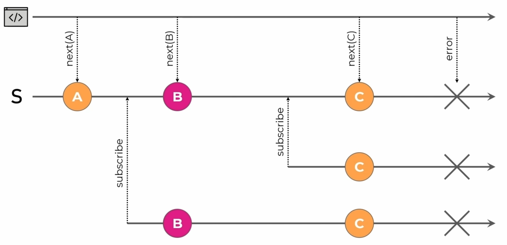

---

##### 12.4.7.1 Behavior subject

- Un **Behavior subject** es una extensión menor pero importante de un _subject_.
- En un **Behavior subject**, cada vez que una nueva suscripción se crea, recibirá una notificación con el último valor emitido.
- Un **Behavior subject** almacena el último valor emitido en memoria.
- Es por tanto que requiere un valor inicial durante su creación.

---

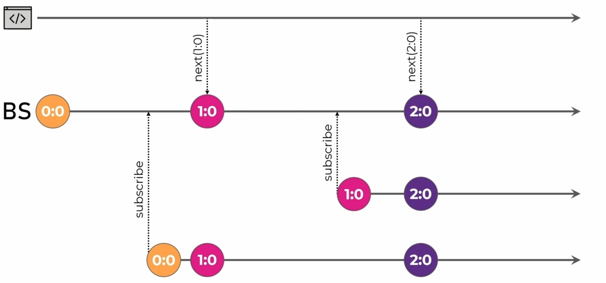

---

#### 12.4.8 Operadores en RxJs

- Los **operadores** son las piezas esenciales que permiten componer de manera fácil y declarativa código asíncrono complejo.
- Los **operators** son funciones.
- Existen dos tipos de **operadores** _de creación_ y _conectables_.

---

##### 12.4.8.1 Creation operators

- Crear los observables desde 0 no es la mejor manera de utilizarlos.
- **RxJs** cuenta con un amplio conjunto de _funciones de creación_.
- Una **creation function (o creation operator)** es una manera sencilla de crear un _observable_ con un comportamiento popular.

---

- _ajax_: permite crear observables que realizan llamadas HTTP.
- _of_: emite los valores proporcionados como argumentos y se completa.
- _from_: convierte cosas como arreglos, promesas, iterables en un observable.
- _fromEvent_: crea un observable a partir de algún objetivo. Suscribirse y cancelar la suscripción funciona aquí como 'addEventListener' y 'removeEventListener'.
- _interval_: genera un observable que emite notificaciones en intervalos.
- _forkJoin_: Acepta una arreglo de observables como entrada. Después de completarse todos estos observables, emite un conjunto de los últimos valores emitidos por cada uno de ellos. Muy útil si necesita esperar por el resultado de un par de llamadas HTTP.
- _combineLatest_: También acepta múltiples observables como entrada. Cada vez que cualquiera de ellos emite algo nuevo, un conjunto combinado de los últimos valores se emitirá como un arreglo.

---

###### 12.4.8.1.1 forkJoin

- Acepta una arreglo de observables como entrada. _Después de completarse todos estos observables_, emite un conjunto de los últimos valores emitidos por cada uno de ellos.
- Muy útil si necesita esperar por el resultado de varias llamadas HTTP.

---

|                                          |                                          |
| ---------------------------------------- | ---------------------------------------- |
| 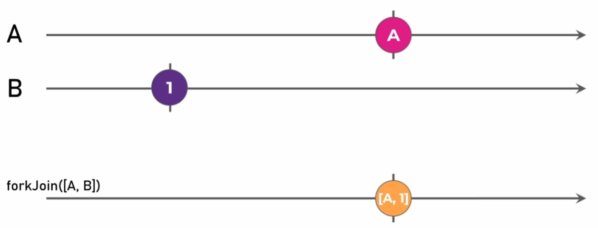 | 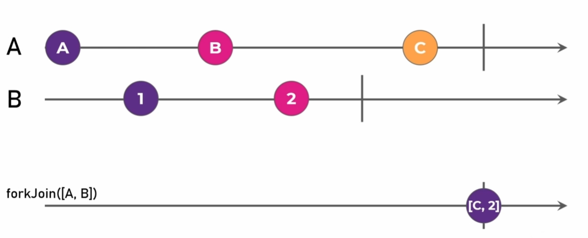 |
| 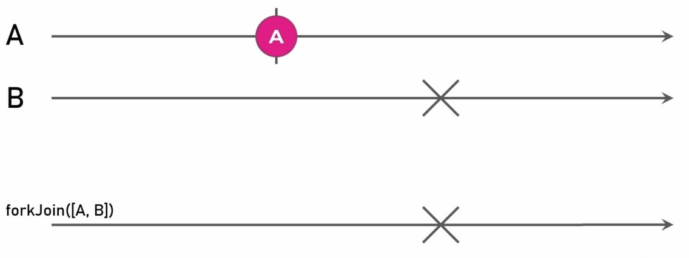 |                                          |

---

###### 12.4.8.1.2 combineLatest

- También acepta múltiples observables como entrada. Cada vez que cualquiera de ellos emite algo nuevo, un conjunto combinado de los últimos valores se emitirá como un arreglo.

---

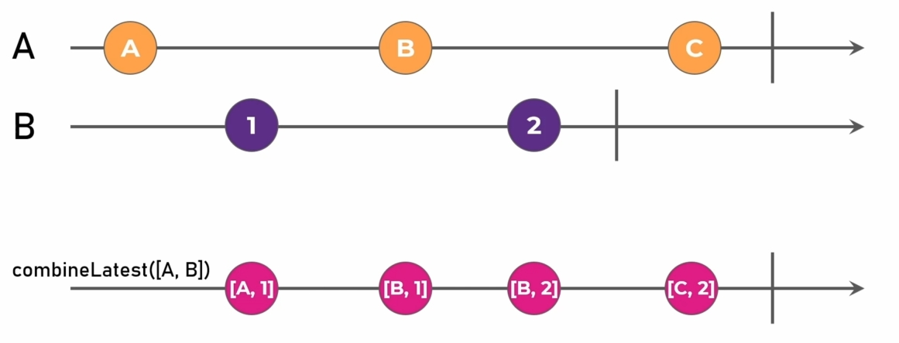

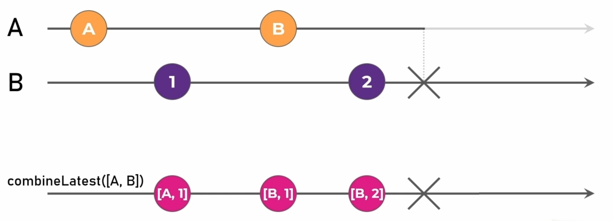

---

##### 12.4.8.2 Pipeable operators

- Son una de las características más poderosas de **RXJS**.
- Nos permiten _transformar_ notificaciones enviadas por un observable de innumerables maneras.
- Nos permite _escribir lógica asíncrona compleja_ con solo unas pocas líneas de código, lo que facilita la lectura y el trabajo.

---

- _filter_: Es similar al operador 'filter' en arreglos de JavaScript, la idea general es la misma. Sin embargo, en lugar de filtrar los elementos en el arreglo, el operador 'filter' filtra los valores emitidos y los pasa a través o no.
- _map_: Es la contraparte en el mundo de streams del operador 'map' de los arreglos en JavaScript. Este operador toma el valor emitido y puede transformarlo en algún otro valor. Útil para extraer una propiedad anidada dentro de un objeto más complejo.
- _tap_: Nos permite causar efectos secundarios sin cambiar las notificaciones. Útil para fines de depuración y aprendizaje.Podemos usarlo para registrar los valores emitidos en cualquier etapa de la tubería de operadores si utilizamos múltiples operadores apilados.
- _debounceTime_: Es útil si la fuente observable emite muchos valores y luego se establece. Esto a menudo se utiliza con las entradas que produce del usuario. Un ejemplo puede ser un escenario en el que el usuario escriba algún valor en un campo de entrada y un valor se re calcula consumiendo tiempo considerable y recursos por cada pulsación de las teclas.
- _catchError_: Cuando la fuente observable presenta una notificación de error, este operador no pasará este error, sino que usará el observable 'fallback' proporcionado como la nueva fuente.

---

##### 12.4.8.3 Flattening operators

###### 12.4.8.3.1 Higher-Order Observables

- Los _observables_ comúnmente emiten valores ordinarios como cadenas y números, pero muy a menudo, es necesario manejar _observables de observables_, llamados **observables de orden superior (Higher-Order Observables)**.
- ¿Cómo trabaja con un **observable de orden superior**? Típicamente, aplanándose: convirtiendo un **observable de orden superior** en un observable ordinario.

---

###### 12.4.8.3.2 Flattening operators

- Un **flattening operator** se subscribe internamente a un _observable_, emitiendo cada valor de una notificación _next_ de sus suscripciones a la salida.
- Mientras la fuente _observable_ siga emitiendo valores, el **flattening operator** seguirá suscribiéndose al observable proporcionado para cada valor.
- Si la fuente emite una notificación de _error_ o _complete_, éstas se emitirán a la salida.

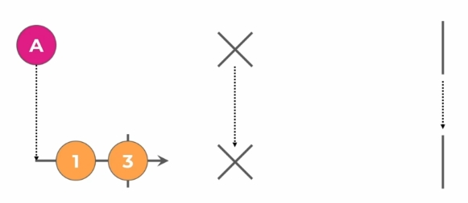

---

- Existen diversos tipos de **flattening operators**, difieren entre ellos en _cómo manejan la concurrencia_.

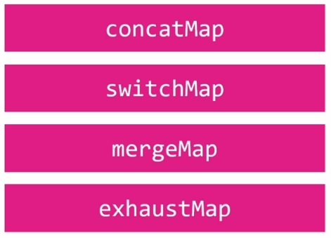

- **Flattening** en el nombre de estos operadores hace referencia a que durante el curso de la suscripción externa, el operador _crea las suscripciones internas_ y todos los valores emitidos por esas suscripciones son aplanados en una sola salida.

---

###### 12.4.8.3.2.1 concatMap

- Proyecta cada valor de una fuente **observable** que se fusiona con el **observable** de salida, de manera serializada esperando que cada uno complete antes de fusionar el siguiente.

---

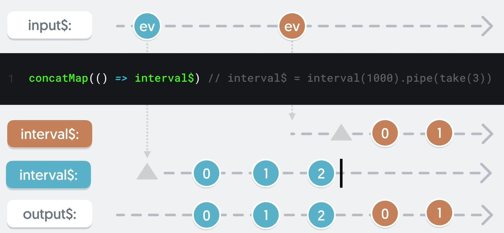

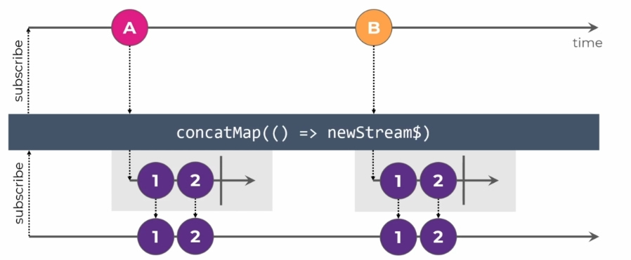

---

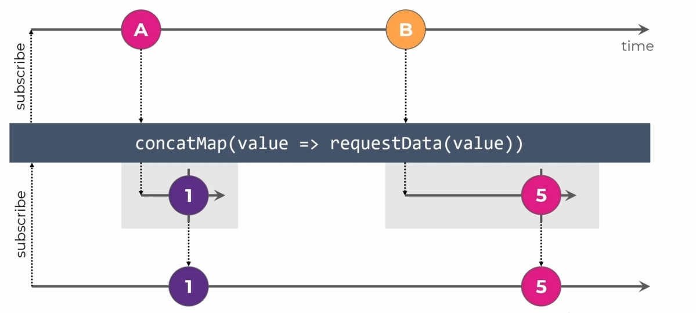

---

- En un **flattening operator** las notificaciones de error son re emitidas al **observable** de salida. Esto es importante porque el error podría detener nuestra suscripción externa dejando de funcionar.
- Si una notificación de _error_ o _complete_ se emite por parte del **observable** interno, el **flattening operator** se de suscribirá del mismo porque ya no es relevante.

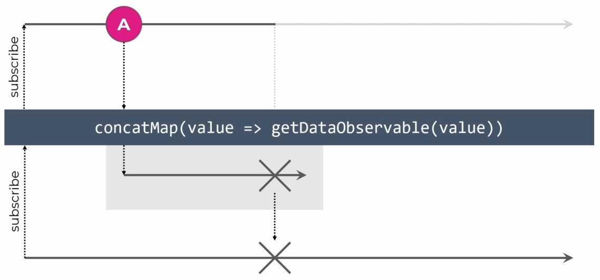

---

- Si queremos controlar el error podemos usar un operador _catchError_. La salida de error del _concatMap_ será la entrada del _catchError_, quien a su vez lo podría reemplazar con un **observable** vació o una salida controlada.

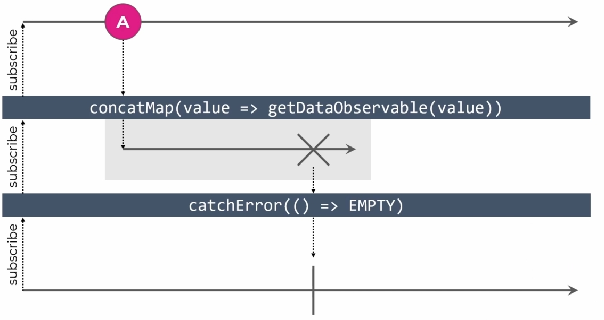

---

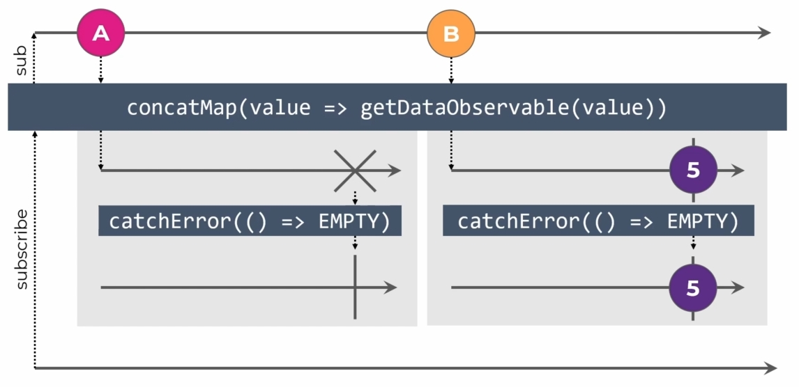

---

- _concatMap_ esperará y no emitirá nuevos valores hasta que finalice la suscripción anterior. Y si nunca termina se quedaría atascado en el manejo de ese **observable**.
- Dadas estas condiciones es el operador más seguro al utilizar al dificultar cometer errores al dejar suscripciones activas no utilizadas, ya que si un **observable** no se completa lo notaríamos inmediatamente ya que el operador no reaccionaría al resto de los valores emitidos por la fuente.

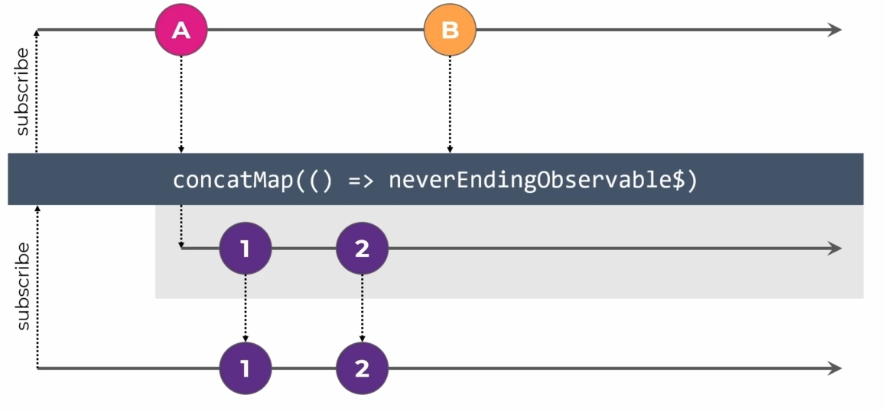

---

- Una ventaja muy importante del operador _concatMap_ es que espera a que la suscripción anterior finalice antes de manejar la siguiente. En otras palabras, garantiza que todos los valores entrantes se manejen uno tras otro.

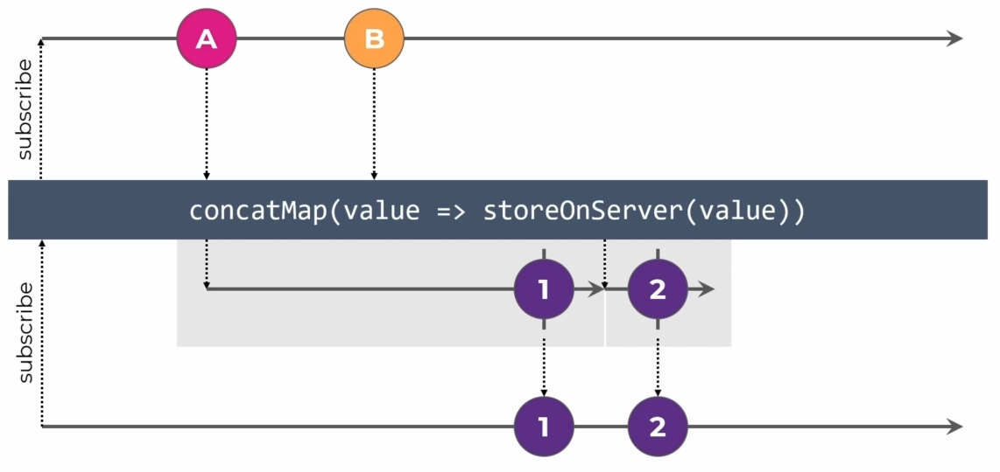

---

###### 12.4.8.3.2.2 switchMap

- Proyecta cada valor de una fuente **observable** que se fusiona con el **observable** de salida, emitiendo valores solo del **observable** proyectado más recientemente.

- El operador _concatMap_ esperaba que la suscripción actual terminara para terminar el cambio de suscripción, _switchMap_ por el contrario simplemente cancela la suscripción anterior e inmediatamente comienza una nueva.

---

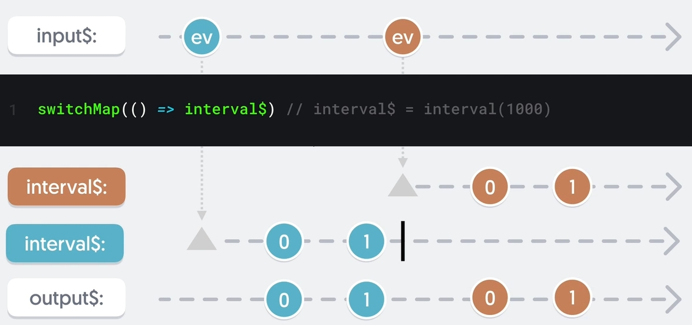

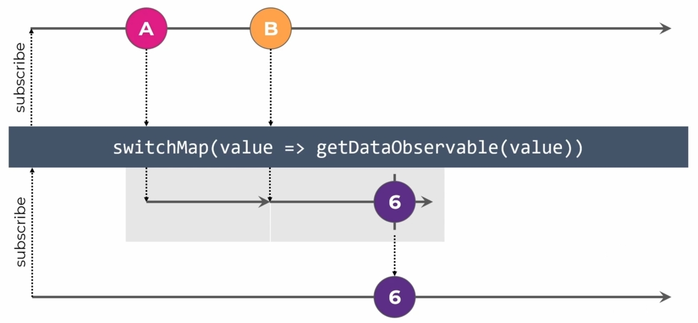

---

- Si no estamos interesados en esperar a que finalice la suscripción anterior y nos gustaría comenzar una nueva lo más rápido posible, _switchMap_ es una buena opción.
- Sin embargo, debemos tener cuidado con una detalle importante al realizar una solicitud HTTP para almacenar datos en el servidor. Podemos iniciar una solicitud HTTP por medio de _switchMap_ e inmediatamente realizar otras más. La solicitud posiblemente ya se haya enviado y llegará al servidor de todos modos, por lo que la des suscripción no garantiza que las solicitudes no lleguen al servidor ni tampoco el orden en que las peticiones llegan. Por lo tanto al guardar datos en el servidor usando _switchMap_ el resultado puede ser impredecible.
- _switchMap_ es muy útil sin embargo si deseamos obtener algo del servidor y solo nos interesa la última respuesta enviada (_type ahead_).

---

###### 12.4.8.3.2.3 mergeMap

- Proyecta cada valor de una fuente **observable** que se fusiona con el **observable** de salida.

- _mergeMap_ emite los valores al **observable** de salida siempre que alguna de las suscripciones internas recibe algún valor, el orden no se maneja aquí de ninguna manera, todo es instantáneo y concurrente.

---

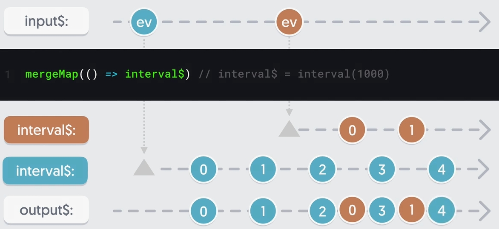

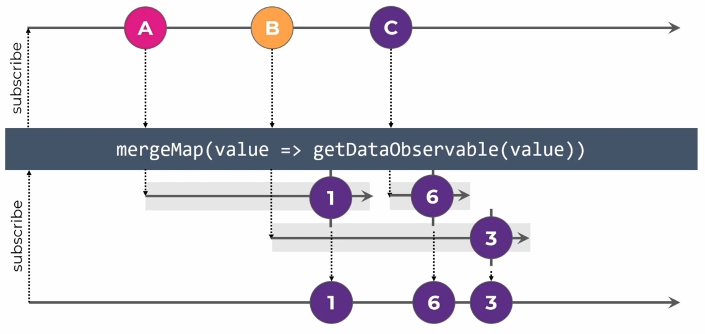

---

- _mergeMap_ es el operador que más fácilmente puede presentar fugas de memoria si no tenemos cuidado de verificar que los **observables** internos emiten una notificación de _complete_, dado que cada valor emitido por el observable fuente genera un nueva subscription a un observable interno.
- Si lo utilizamos para enviar solicitudes HTTP, debemos tener en cuenta que el orden no se garantiza, tanto de nuestro lado como del lado del servidor.

---

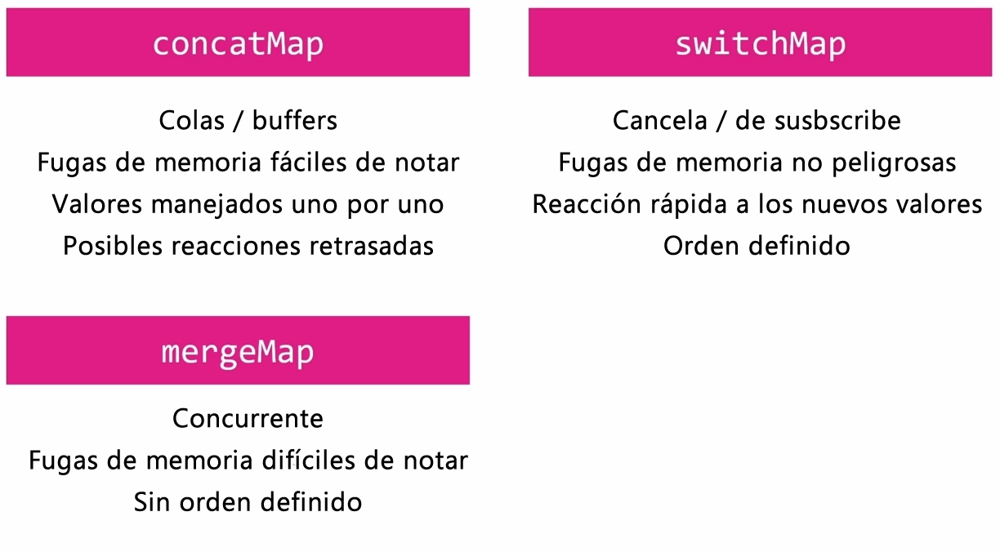

---

###### 12.4.8.3.2.4 exhaustMap

- Proyecta cada valor de una fuente **observable** que se fusiona con el **observable** de salida, solo si se ha completado el **observable** proyectado anterior.

---

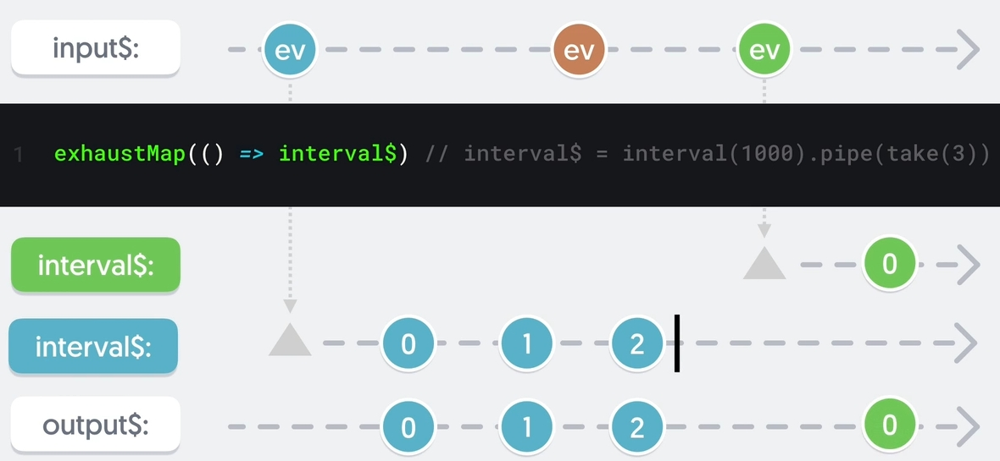

---

#### 12.4.9 ¿Qué es el desarrollo reactivo?

- El paradigma declarativo se encarga de los _flujos de datos_ y la _propagación de los cambios_.
- El código es **reactivo** cuando un _cambio_ en alguna _entrada_ conduce a un _cambio automático_ en la _salida_.

---

Volverse reactivo significa:

- Dejar atrás los _patrones procedurales_.
- _Trabajar con observables directamente_, en lugar de leer datos en un arreglo y después vincular a ese arreglo, utilizaremos y vincularemos observables
- Crear _observable pipelines_ que reaccionen a datos emitidos, mientras que utilizamos los operadores disponibles en RxJs
- _Transformar_, _componer_ y _combinar_ observables para manejar múltiples fuentes de datos
- Definir _action streams_ para fácilmente reaccionar a las acciones del usuario

---

<!-- _class: invert lets_code -->

# Let's code • Part 2

---

<!-- •••••••••••••••••••••••••••••••••••••••••••••••••••••••••••••••••••••••••••

	13. Angular Routing

••••••••••••••••••••••••••••••••••••••••••••••••••••••••••••••••••••••••••• -->

## 13. Angular Routing

- Hemos usado _directivas_ para renderizar diferentes porciones de una página.
- ¿Qué debemos hacer si queremos renderizar diferentes páginas y navegar entre ellas?
- Angular provee su propio _Router_ y múltiples mecanismos para la navegación.
- El efecto que conseguiremos es presentar sistemas completos, compuestos de múltiples secciones y páginas mientras seguimos en el contexto de una _SPA (Single Page Application)_.
- https://angular.io/guide/developer-guide-overview

---

- En este ejercicio se presentaran diversos conceptos del _Angular Router_ como:
  - Organizar la aplicación en _módulos_
  - _Navegación_ a un componente
  - _Paso de parámetros_
  - _Rutas anidadas_
  - Manejo de _guards_
  - _Lazy loading_

Nota: Para este ejercicio utilizaremos componentes de **Angular Material**.

---

<!-- •••••••••••••••••••••••••••••••••••••••••••••••••••••••••••••••••••••••••••

	14. Angular Material

••••••••••••••••••••••••••••••••••••••••••••••••••••••••••••••••••••••••••• -->

## 14. Angular Material

- **Angular Material** ofrece una amplia variedad de componentes de interfaz de usuario basados en la especificación de -Material Design\_.
- https://material.angular.io/

---

<!-- _class: invert lets_code -->

# Let's code • Part 3

---

<!-- •••••••••••••••••••••••••••••••••••••••••••••••••••••••••••••••••••••••••••

	15. Angular Forms

••••••••••••••••••••••••••••••••••••••••••••••••••••••••••••••••••••••••••• -->

## 15. Angular Forms

- En **Angular** existen 2 mecanismos principales para desarrollar formularios:
  &nbsp;
  - _Template-driven forms_: Depende de directivas en la plantilla para crear y manipular el modelo objeto del formulario. https://angular.io/guide/forms
    &nbsp;
  - _Reactive forms_: Proporciona acceso directo y explícito al modelo objeto del formulario. https://angular.io/guide/forms-overview

---

<!-- •••••••••••••••••••••••••••••••••••••••••••••••••••••••••••••••••••••••••••

	16. TailwindCSS

••••••••••••••••••••••••••••••••••••••••••••••••••••••••••••••••••••••••••• -->

## 16. TailwindCSS

- **TailwindCSS** es un _'utility-first framework'_ en CSS, que aporta un conjunto de clases, con las cuales se puede hacer composición para construir cualquier diseño, directamente desde la vista.
  &nbsp;
- https://tailwindcss.com/
  &nbsp;
- Tailwind CSS IntelliSense, https://marketplace.visualstudio.com/items?itemName=bradlc.vscode-tailwindcss
  &nbsp;
- Tailwind Docs, https://marketplace.visualstudio.com/items?itemName=austenc.tailwind-docs

---

<!-- _class: invert lets_code -->

# Let's code • Part 4

---

# GRACIAS

---

